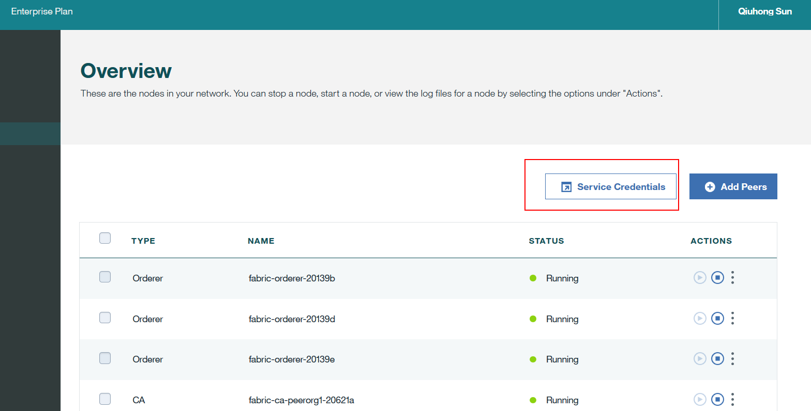
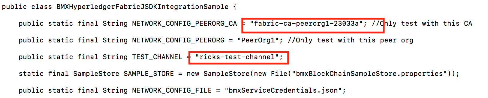
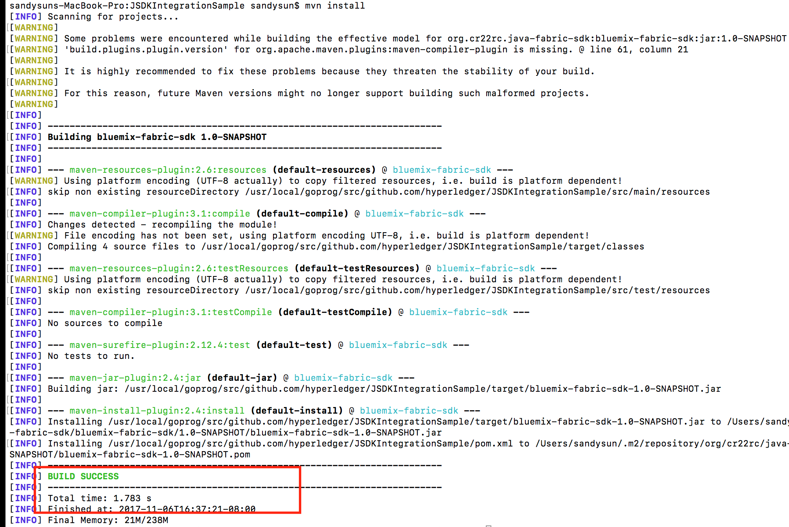
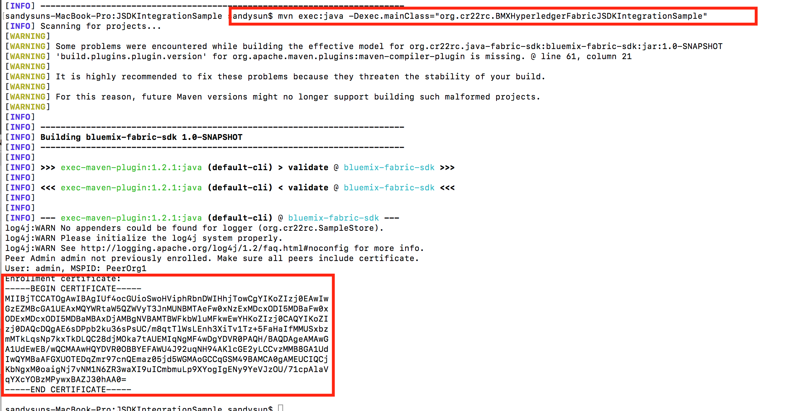
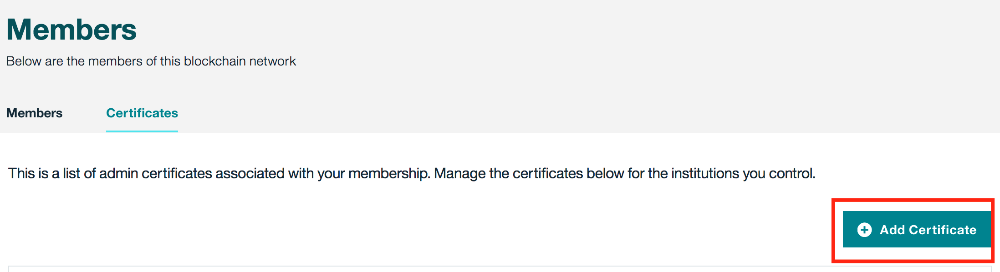
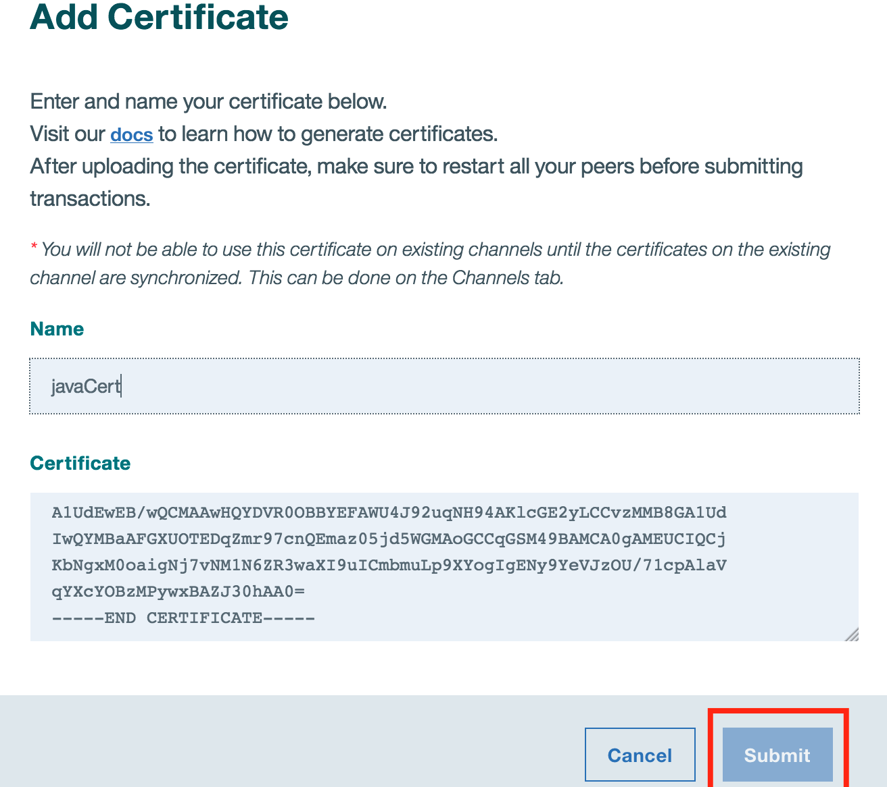

# BMXHyperledgerFabricJSDKIntegrationSample

This document shows how to integrate the IBM hyperledger Java SDK with IBM bluemix blockchain. To use Bluemix IBM Blockchain Service, follow https://github.com/IBM-Blockchain/marbles/blob/v4.0/docs/use_bluemix_hyperledger.md to create a Blockchain Network in IBM Bluemix, peers (up to 3) and a channel. You can change the channel name from “marbles-trading-alliance” to “java-test-channel” (or you named channel name). 

## Hyperledger Fabric Java SDK  Version
 Requires Java SDK 1.1.0-SNAPSHOT
 
## Down load the repository to your local 
git clone https://github.com/IBM-Blockchain/JSDKIntegrationSample

## Obtain the content of "Service Credential" from bluemix network and save it as "bmxServiceCredentials.json"
From your dashboard Overview, click on "Service Credentials", copy and paste all the information to a file named "bmxServiceCredentials.json". Save this file to the location where you download the repository


## Modify BMXHyperledgerFabricJSDKIntegrationSample.java with your own data
Two places need to be changed:
NETWORK_CONFIG_PEERORG_CA: get network ca information from bmxServiceCredentials.json
TEST_CHANNEL: update with your own channel name. (e.g. java-test-channel)


## Installing
 Run command:
  ```mvn install```
 Go to the download folder and issue “mvn install”, confirm with “BUILD SUCCESS” message
 
 
## Running

Run command: 
```mvn exec:java -Dexec.mainClass="org.cr22rc.BMXHyperledgerFabricJSDKIntegrationSample"```
First time run, it will generate the cert for user "admin", and credential info was saved to "bmxBlockChainSampleStore.properties"


## Upload the certification to bluemix

Copy and paste CERTFICATE from java test case output to bluemix web GUI



Tip: if the submit button is disabled, just add CR to ------END CERTIFICATE-----

## Running it again
We should able to see invoke transaction and query runs are successful.


## Introduction Video
An introduction video is in Videos/bmxJSDKIntro.webm


[![demo video]](https://github.com/IBM-Blockchain/JSDKIntegrationSample/blob/master/Videos/bmxJSDKIntro.webm)


## Video Screen Shots
Screen shots are in screenShots directory